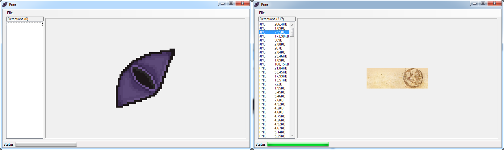

# Peer
A GUI tool for finding files embedded inside other files  
Allows for detection, preview and extraction of a variety of different file-types
Detection is based on file signatures ("Magic Bytes") and file structure

## Screenshots

## Supported formats
 * JPG
 * PNG
 * WAV
 * MP3*
 * Ogg

*: Currently only supports MP3 files with an ID3v2 header

## Disclaimer
This program was created for educational purposes  
It is not intended to be used for reverse-engineering or extracting files for usage beyond their original intent  